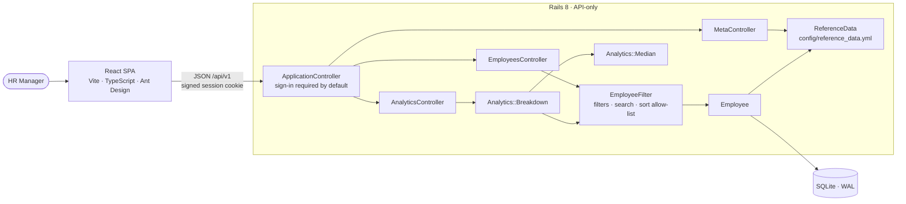

# Salary Management — Architecture

How the system is built, why it is built that way, and what each choice costs.

[`REQUIREMENTS.md`](REQUIREMENTS.md) says what the app is for and what is out of
scope; [`PLAN.md`](PLAN.md) is the plan it was built to. This document is the
record of what was actually built, including the decisions that only surfaced
once the code existed, and the measurements behind the performance claims.

## 1. Shape of the system

One Rails service and one SPA, on one origin. In development Vite proxies
`/api` to Rails. The intended deployment is that same single service with the
built SPA dropped into Rails' `public/` — not wired up here, because deployment
is out of scope (§8), but it is the assumption the rest of the design rests on:
one origin means no CORS configuration and no token in `localStorage`, because
there is no second origin to need either.

**The rule the whole design bends around:** a salary figure belongs to exactly
one country and is never converted. That is not only a UI convention — it is
enforced in `EmployeeFilter` and `Analytics::Breakdown`, so no caller can ask
the API for a mixed-currency number, and the UI's job is only to keep the user
from finding that out through an error message.

## 2. How one request is served

`GET /api/v1/analytics/breakdown?group_by=level&country=IN&job_title=Software+Engineer`

1. **`Authentication`** resolves the signed `session_id` cookie to a `Session`
   row. No row, no request: `401`. Sign-in is required by default (a
   `before_action` in `ApplicationController`), so a new controller is
   protected by inheritance rather than by remembering to protect it.
2. **`EmployeeFilter`** turns the params into a scope. Unknown values are
   rejected with a `400`, never ignored: quietly dropping `department=Enginering`
   would show more people than the caller thinks they are looking at.
3. **`Analytics::Breakdown`** refuses the question if it would mix currencies —
   any grouping other than `country` requires a country filter — then runs one
   `GROUP BY` for count, min, max and sum, and plucks the salaries for the
   medians.
4. **`Analytics::Median`** computes each median exactly (a `Rational`, not a
   float), because SQLite has no median function.
5. **`BreakdownSerializer`** rounds median and average to whole currency units
   and labels every row with its currency.

Errors take one shape — `{ "error": { "code", "message" } }` — so the SPA
branches on a stable code (`country_required`, `invalid_credentials`) rather
than on prose. Validation failures are the one exception: they return
`{ "errors": { "field": ["message"] } }`, because the form has to put each
message under the input that caused it.

## 3. Data model

One domain table. Reference data lives in code, not in tables.

| Column | Type | Rules |
|---|---|---|
| `employee_code` | string | required, unique, upcased on write (`EMP-00001`) |
| `first_name`, `last_name` | string | required, trimmed |
| `email` | string | required, format-checked, unique case-insensitively, downcased on write |
| `country_code` | string(2) | required, must be in the catalog |
| `department` | string | required, must be in the catalog |
| `job_title` | string | required, and must be a title *of that department* |
| `level` | string | required, `L1`–`L6` |
| `annual_salary` | integer | required, whole units of local currency, > 0 |
| `hire_date` | date | required, not in the future |

**Indexes:** unique on `employee_code` and on `LOWER(email)`; plain indexes on
`country_code`, `department`, `job_title` and `level` — every column the list
and the analytics filter or group by.

**Currency is not a column.** It is derived from `country_code` through
`ReferenceData`, so the two can never disagree; `Employee#currency` and the
serializers put it on every response that carries money. The API ignores a
`currency` sent in a create or update for the same reason.

**`users`** (unique `email_address`, `password_digest`) and **`sessions`**
(`user_id`, `ip_address`, `user_agent`) come from the Rails 8 authentication
generator. There is one seeded HR Manager, whose credentials come from
`HR_MANAGER_EMAIL` and `HR_MANAGER_PASSWORD`.

**No delete.** Someone leaving should be recorded, not erased, and that needs a
status and an end date rather than a `DELETE` — so the route does not exist.

## 4. API

Everything is under `/api/v1` and answers JSON. Every endpoint except
`POST /session` returns `401` without a valid session cookie.

| Endpoint | Notes |
|---|---|
| `POST /session` | Email and password. `201` with the user, or `401` with `invalid_credentials` — deliberately vague about which half was wrong. Rate limited to 10 attempts per IP per 3 minutes. |
| `GET /session` | Who is signed in. The SPA calls it on load; not signed in is a `401`, not an empty `200`. |
| `DELETE /session` | Destroys the session row, so it stops working immediately. `204`. |
| `GET /employees` | `q`, `country`, `department`, `job_title`, `level`, `sort`, `direction`, `page`, `per_page`. Returns `{ data, meta: { page, per_page, total } }`. Default 25 per page, hard ceiling 100. |
| `GET /employees/:id` | One employee, or `404`. |
| `POST /employees`, `PATCH /employees/:id` | `201`/`200` with the record, or `422` with per-field messages. |
| `GET /meta` | The catalog behind every dropdown: countries with currencies, departments with their job titles, a flat title list, and levels. |
| `GET /analytics/breakdown` | `group_by` ∈ `country`, `department`, `job_title`, `level`, plus the same filters as the list. Rows carry `currency`, `headcount`, `min`, `median`, `average`, `max`, `total`. |

Two rules are enforced by the API rather than trusted to the client, and both
exist because salaries are never converted:

- **Sorting by `annual_salary` requires `country`.** Otherwise the list would
  rank 90,000 USD below 2,400,000 INR.
- **Any `group_by` other than `country` requires `country`.** "The median for
  Engineering" across eight currencies is not a number.

Both return `400` with the code `country_required`. The SPA mirrors the rules
in its own UI — the salary column is only sortable once a country is chosen,
and the within-country view asks for a country before it asks anything of the
API — so the refusal is something the user is guided past, not something they
hit.

## 5. Decisions and trade-offs

| Decision | Why | What it costs |
|---|---|---|
| **Never convert currency** | Rates move daily, so a converted figure would change on a day when nobody's pay did. Acting on that is the expensive kind of wrong. | There is no single organisation-wide payroll number. Countries are read side by side, and only headcount totals across them. |
| Rails 8 API-only + SQLite (WAL) | Set by the brief, and ample for 10k rows and one user. | Limited write concurrency, which one HR Manager never meets. |
| Session cookie, not a token | Same-origin SPA: a signed, `httpOnly`, `SameSite=Lax` cookie cannot be read by JavaScript, and a session is a row that can be revoked. | `ActionDispatch::Cookies` has to be added back to the API middleware stack. CSRF cover comes from `SameSite` plus a JSON-only API, not Rails' form tokens. |
| Sign-in required by default | A `before_action` in `ApplicationController`; endpoints opt *out*, not in. | – |
| Reference data in `config/reference_data.yml` | The catalog rarely changes and there is no admin UI for it. Validating against a fixed list of job titles is what keeps "pay for this role" answerable — free text fragments into near-duplicates. | Adding a country or job title is a code change and a deploy. |
| Money as `integer`, whole units | SQLite has no true decimal type, and annual salaries don't need cents. Sums stay exact. | No fractional amounts; a currency with different minor-unit conventions would need revisiting. |
| Currency derived, not stored | The country is the single source of truth, so the two cannot drift. | Every response that carries money has to look the currency up (an in-memory hash). |
| One `EmployeeFilter` for the list *and* the analytics | "department=Sales" then means the same people in a table row and in a median, and the rules are tested once. | The filter object carries both list concerns (sorting) and analytics concerns (scope). |
| Unknown filter values are a `400`, not ignored | Silently dropping a filter shows more people than the caller believes they are seeing. | A hand-typed URL fails loudly. The SPA treats that as the error to display. |
| Aggregates in SQL, medians in Ruby | The database counts, sums and finds extremes; SQLite has no median function, so 10k plucked integers are sorted in Ruby — milliseconds, and nothing can go stale. | Two passes over the same scope, and a bound that moves with row count (see §6). |
| Computed on read, nothing precomputed | An edited salary is reflected in the next request with no cache to invalidate. | Would not hold at much larger scale. |
| Plain serializer POROs + Pagy | Explicit JSON shapes, little code to own, no DSL to learn. | Shapes are hand-written and hand-kept in step with the TypeScript types. |
| `json` gem pinned to 2.x | json 3.0 made `JSON.parse`'s options keyword-only, but `ActiveSupport::JSON.decode` still passes them positionally, which breaks every signed-cookie read. | A pin to remove once Rails catches up; noted in the `Gemfile`. |
| Ant Design + TanStack Query + Recharts | Table, Form and Drawer cover server-side pagination, sorting and validation display — the bulk of a data-heavy admin tool — and Query handles caching and refetching. | The bundle: 1.64 MB raw, 510 kB gzipped. Acceptable for an internal tool behind a login, and the first thing to code-split if it stops being. |
| Filters, sort, page and the insight question live in the **URL** | "India, by level, Software Engineers only" is a question someone asks again next quarter or sends to a colleague. The URL is the one piece of state that bookmarks, shares and works with the back button. | Every state change is a navigation, so the search box debounces rather than writing a history entry per keystroke. |
| API field names kept in `snake_case` on the client | A mapping layer is one more place for a field to go missing, and forms post back the same names the server validates. | TypeScript code reads with two naming conventions. |
| One `BreakdownTable` for both insight views | What differs between them is the currency, not the layout: shared currency means salary columns sort and payroll totals; mixed currencies mean neither. Encoding that once keeps the rule from being re-litigated per screen. | One component with a mode flag. |

## 6. Performance, measured

Every figure below was measured against the full 10,000-employee seed, not
assumed. Anyone can repeat it: seed, start the server, and time the endpoints.

**Method.** Apple M4 Pro, macOS 26.6.2, Ruby 3.2.2, Rails 8.1.3.1, SQLite
3.53.2 in WAL mode, 10,000 employees. Rails in the **development** environment
over loopback, three warm-up requests, then 20 timed requests per endpoint with
`curl -w %{time_total}`. Development is the slower environment — it reloads
code and logs verbosely — so production numbers would be lower, not higher.

| Endpoint | Median | p95 |
|---|---:|---:|
| `GET /meta` | 1.4 ms | 1.5 ms |
| `GET /employees` (page 1, no filters) | 2.5 ms | 3.5 ms |
| `GET /employees?page=200` (last page) | 2.4 ms | 3.0 ms |
| `GET /employees?q=ann` (search) | 4.5 ms | 5.2 ms |
| `GET /employees?country=IN&sort=annual_salary&direction=desc` | 2.6 ms | 3.0 ms |
| `GET /employees?country=IN&department=Engineering&level=L3` | 2.9 ms | 3.1 ms |
| `GET /analytics/breakdown?group_by=country` (all 10,000 rows) | 10.5 ms | 23.3 ms |
| `GET /analytics/breakdown?group_by=department&country=IN` | 4.5 ms | 5.2 ms |
| `GET /analytics/breakdown?group_by=job_title&country=IN` | 4.6 ms | 5.2 ms |
| `GET /analytics/breakdown?group_by=level&country=US` | 4.1 ms | 8.3 ms |

Seeding all 10,000 employees takes **≈1.4 s** end to end, including booting
Rails — one `INSERT` per 1,000 rows rather than 10,000 round trips.

What makes those numbers what they are:

- **Nothing returns 10,000 rows.** The list is always paginated, with a ceiling
  of 100 per page, so response size never depends on the size of the workforce.
- **Every filtered column is indexed**, and paging is ordered with an `id`
  tiebreak so a row cannot appear on two pages.
- **The slowest endpoint is the one that touches every row**: grouping by
  country plucks all 10,000 salaries to compute eight medians in Ruby. At
  10 ms that is not worth optimising; it is simply the shape of the cost.

**Where this stops working.** The honest limits, in the order they would be hit:

1. **Medians in Ruby, at roughly 1M rows.** The pluck-and-sort is linear in the
   number of employees. The fix is precomputed per-group statistics, refreshed
   on write — at which point "computed on read, never stale" is the thing being
   given up.
2. **`LIKE '%term%'` search, at a few hundred thousand rows.** It cannot use an
   index. The upgrade path is SQLite's FTS5.
3. **SQLite writes, when there is more than one writer.** WAL allows one writer
   at a time, which is exactly right for one HR Manager and wrong for a team.
   That is a move to PostgreSQL, not a tuning exercise.

## 7. Testing

178 backend examples run in about a second: model validations, the median
helper, `EmployeeFilter`, `Analytics::Breakdown` and the seed generator as
units, plus request specs covering authentication, the employee endpoints and
the analytics endpoint. The analytics expectations are **hand-computed** from
about ten employees across two countries, written into the spec as arithmetic a
reader can check, rather than captured from the implementation's own output —
a test that records what the code does would have agreed with any bug it had.

The frontend carries a small Vitest suite and is covered by `tsc` and oxlint.
Browser end-to-end tests are deliberately absent: they are worth their setup
and flakiness once there is somewhere deployed to run them against.

CI runs all of it — RSpec, RuboCop, `tsc`, oxlint, Vitest and the production
build — on every push and pull request.

## 8. Not covered here

Deployment. The architecture is deliberately deployable as one thing — a single
Rails process serving the API and the built SPA from a file-based database —
but no pipeline, container or host is part of this work. The same goes for
Excel import, CSV export, salary history and everything else in the exclusions
table in [`REQUIREMENTS.md`](REQUIREMENTS.md); the reasoning for each is there
rather than repeated here.
