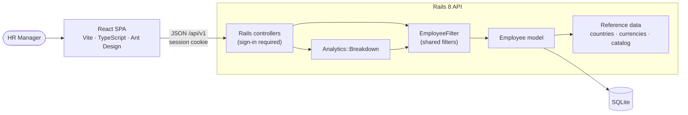

# Salary Management — Implementation Plan

## 1. Objective

Replace the HR team's spreadsheets with a web app where the HR Manager can:

1. **Manage salary data**: find, create, and update records for ~10,000 employees across several countries.
2. **Answer questions about pay**: what each country costs, and how pay varies within a country by department, role, and level.

The aim is a small system that is correct end to end, with clear decisions and trade-offs, rather than a large one.

## 2. Guiding principles

- **Vertical slices first, polish later.** Get a thin backend → API → UI path working, then widen it.
- **A few trustworthy insights beat many shaky ones.** The HR Manager will act on these figures. So there are only two insight views, every statistic is defined precisely and shown next to its headcount, and each is tested against hand-computed values.
- **Never mix currencies.** Salaries are never converted, because exchange rates change and a converted figure would move even when nobody's pay did. Every salary figure is computed within one country and labelled with that country's currency.
- **Every commit runs and passes its tests.** The commit history should read as the solution evolving.
- **Write decisions down.** Each notable choice records what was chosen, why, and what it gives up.

## 3. Scope at a glance

The one-page `REQUIREMENTS.md` formalises this; it is the first thing written, before any code.

| Priority | Items |
|---|---|
| **Must** | Login for the single HR Manager, with all data behind sign-in · Employee list with search, filters (country, department, level, job title), sorting, and server-side pagination · Create and update employees with validation · Deterministic seed of 10,000 employees · Insights: **pay by country** and **pay within a country** by department, job title, or level (headcount, min, median, average, max, total), always in local currency · Unit and request tests · Docs |
| **Should** | A bar chart next to the within-country table · CI pipeline |
| **Could** | CSV export of the filtered employee list |
| **Won't (now)** | Currency conversion · Pay outliers, percentile bands, distributions · Salary history and effective dates · Multiple roles and permissions · Password reset, SSO, MFA · Bulk Excel/CSV import · Deleting or offboarding employees · Bonus, equity, allowances, total compensation · Payroll processing, payslips, tax · Gender or other protected-attribute pay-gap analysis · Audit log · Managing reference data in the UI · i18n |

The requirements doc explains the main exclusions. One more is worth calling out: importing from Excel is the natural migration path from today's spreadsheets, but it needs row-level validation and error reporting to be trustworthy, so it is the top follow-up rather than a rushed feature.

**Assumptions:** salary means annual base gross pay. Each employee belongs to one country and is paid in that country's currency. A single HR Manager uses the system, so there is no concurrent-editing problem to solve.

## 4. Architecture

| Decision | Choice | Why | Trade-off |
|---|---|---|---|
| Repo layout | Monorepo: `backend/`, `frontend/`, `docs/` | One history, and one commit can change the API and UI together | The two toolchains sit side by side |
| Backend | Rails 8, API-only, SQLite (WAL mode, the Rails 8 default) | Set by the brief; plenty for 10k rows and one user | Limited write concurrency, which is irrelevant here |
| Frontend | Vite + React + TypeScript, **Ant Design**, TanStack Query, React Router, Recharts | Ant Design's Table and Form handle server-side pagination, sorting, filters, and validation display, which fits a data-heavy admin tool. TanStack Query handles caching and refetching. | Ant Design is large and its look is opinionated |
| Frontend ↔ API | Vite dev proxy for `/api`. The production build is served by Rails from `public/`. | One origin, so no CORS, and the app ships later as a single service | Rails must serve static assets |
| Authentication | Rails 8 authentication generator: `User` with `has_secure_password`, server-side `Session` records, a signed `httpOnly`, `SameSite=Lax` session cookie, and rate-limited login | Built into Rails, so no extra gems. With a same-origin SPA a cookie is simpler and safer than a token in `localStorage`, and sessions can be revoked on the server. | API mode needs the cookie middleware added back. CSRF protection comes from `SameSite` plus a JSON-only API, not Rails' form tokens. |
| Reference data | Kept in code (`config/reference_data.yml`): countries → currency, departments, job titles per department, levels | These change rarely and no admin UI for them is required. Validating against a catalog keeps the analytics clean, whereas free-text job titles fragment them. | Adding a department or title needs a code change |
| Money | `annual_salary` stored as an **integer in whole units of local currency** | SQLite has no true decimal type, and annual salaries don't need cents. Integers keep sums exact. | Can't record fractional amounts |
| Currency | **Never converted.** The API only computes salary figures inside one country: grouping by anything other than country requires a `country` filter, and sorting the employee list by salary requires one too. | Converted figures would shift with exchange rates even when no one's pay changed, which would mislead decisions | There is no single org-wide payroll number. Countries are compared side by side, each in its own currency. |
| Filtering | One `EmployeeFilter` query object, used by both the employee list and the analytics | The same filters mean the same thing everywhere, and they are written and tested once | – |
| Analytics | Computed on read: SQL `GROUP BY` for count, min, max, average, and sum. Medians in Ruby over plucked salaries. | At most 10k integers takes milliseconds, and nothing goes stale. SQLite has no median function. | Would need precomputed stats at much larger scale |
| Serialisation and pagination | Plain serializer POROs + Pagy | Explicit, fast, little code to own | Hand-written JSON shapes |
| Tests | RSpec + FactoryBot (backend), Vitest + React Testing Library (frontend) | Readable, widely known, fast | – |

## 5. Data model

An `employees` table for the domain, plus `users` and `sessions` for sign-in. Reference data comes from the catalog, not from separate tables.

| Column | Type | Rules |
|---|---|---|
| `employee_code` | string | required, unique (`EMP-00001`) |
| `first_name`, `last_name` | string | required |
| `email` | string | required, unique (case-insensitive), valid format |
| `country_code` | string(2) | ISO 3166, must be in the catalog |
| `department` | string | must be in the catalog |
| `job_title` | string | must be in the catalog for that department |
| `level` | string | `L1`–`L6`, ordered by the catalog |
| `annual_salary` | integer | required, > 0 |
| `hire_date` | date | required, not in the future |
| timestamps | | |

- **Currency is derived from the country and not stored.** The country is the single source of truth. The form shows the currency next to the salary field as read-only.
- **Indexes:** unique on `employee_code` and `lower(email)`. Plain indexes on `country_code`, `department`, `level`, and `job_title`.
- **`users`** (`email_address` unique, `password_digest`) and **`sessions`** (`user_id`, `ip_address`, `user_agent`) come from the Rails generator. There is one seeded HR Manager user, whose credentials come from environment variables with documented development defaults.

## 6. API (`/api/v1`)

| Endpoint | Purpose |
|---|---|
| `POST /session` / `DELETE /session` | Sign in with email and password, or sign out |
| `GET /session` | The current user, so the SPA can check whether it is signed in on load |
| `GET /employees` | List. Params: `q` (name, email, or code), `country`, `department`, `level`, `job_title`, `sort` (allow-listed), `direction`, `page`, `per_page`. Sorting by salary requires `country`. Returns `{ data, meta: { page, per_page, total } }`. |
| `GET /employees/:id` | Show one employee |
| `POST /employees` / `PATCH /employees/:id` | Create or update. Returns `422` with `{ errors: { field: [messages] } }` on validation failure. |
| `GET /meta` | Reference data for the form and filter dropdowns: countries with currencies, departments, job titles, and levels |
| `GET /analytics/breakdown` | `group_by` ∈ {country, department, job_title, level}, plus the same filters as the list. Each row has `currency`, headcount, min, median, average, max, and total. `group_by=country` returns one row per country, each in its own currency. Any other `group_by` requires `country`. |

Every endpoint except sign-in returns `401` without a valid session. Errors use one consistent JSON shape: `401` when not signed in, `404` for unknown ids, and `400` for invalid params, such as an unknown `group_by` or a missing `country` where one is required.

## 7. Insights: questions the HR Manager can answer

There are only two views. Both use the single breakdown endpoint.

| Question | View |
|---|---|
| Where are our people, and what does each country cost us? | **Pay by country:** one row per country with headcount, total annual payroll, and min, median, average, and max salary, all in that country's currency. Only the headcount is totalled across countries. |
| Within a country, how does pay compare across departments, job titles, or levels? What do we pay a given role at each level? | **Pay within a country:** pick a country, then group by department, job title, or level. Optionally narrow by department, job title, or level: for example, India → group by level → job title "Software Engineer". Same figures on every row. |

**Rules for the statistics:**

- **Currency:** every salary figure is in the local currency of exactly one country, and the currency code is shown with it. Nothing is ever converted.
- **Median:** the middle value, or the mean of the two middle values when the count is even. This matches Excel's `MEDIAN`.
- **Average:** rounded to whole currency units for display.
- **Headcount:** every statistic is shown next to its headcount, so a figure based on only a few people is easy to spot.

## 8. Seed data

- `Seeds::EmployeeGenerator.new(count:, seed:)` returns attribute hashes. `db/seeds.rb` clears the table and bulk-inserts with `insert_all` in batches of 1,000. It is idempotent and should finish in seconds.
- **Deterministic:** a fixed `Random` seed and a seeded Faker, so every run produces the same data.
- **Realistic enough to make the insights meaningful:**
  - About 8 countries with different currencies, weighted by headcount. Departments are weighted too, with Engineering the largest.
  - Salary = role base × level multiplier × a per-country pay scale in local currency, with ±15% noise, then rounded. The pay scale is only used to generate data; the app never converts.
  - Hire dates spread over the past decade.

## 9. Frontend

- **Sign-in:** a login page and a route guard. On load the app checks `GET /session`. Any `401` from the API sends the user back to the login page, and the header has a sign-out action.
- **Layout:** a sidebar with two areas, **Employees** and **Insights**.
- **Employees page:**
  - Ant Design Table with server-side pagination and sorting. Salary shows with its currency, and the salary column can only be sorted once a country filter is set.
  - A filter bar (country, department, level, job title) and debounced search.
  - **Filter, sort, and page state lives in the URL**, so views can be bookmarked and shared, and the back button works.
  - Create and edit happen in a drawer form. Dropdowns are driven by `/meta`, the salary field shows the currency, and server validation errors appear on the matching fields.
- **Insights page:**
  - **Pay by country:** a table, with total headcount in the footer.
  - **Pay within a country:** a country picker, a group-by toggle (department, job title, level), and optional filters. Results show as a table and a bar chart of the median per group.
- **Structure:**
  - `src/api/`: typed client, response types, and TanStack Query hooks.
  - `src/features/employees/` and `src/features/insights/`.
  - `src/lib/format.ts`: currency and number formatting with `Intl.NumberFormat`, using each row's currency code.

## 10. Testing strategy

The goal is a meaningful, fast, deterministic suite that stays readable.

**Backend unit tests:**

- **Employee validations:** required fields, catalog membership, job title belongs to its department, salary > 0, case-insensitive email uniqueness, no future hire date.
- **Median helper:** table-driven cases for odd and even counts, a single element, and an empty input.
- **`EmployeeFilter`:** each filter, search across name, email, and code, the sort allow-list, and the rule that salary sorting needs a country.
- **`Analytics::Breakdown`:** checked on about 10 hand-built employees across two countries, with **hand-computed expected values**. It covers:
  - Each `group_by` option.
  - Grouping by country gives one currency per row.
  - Any other grouping without a country is rejected.
  - Filters narrow the results correctly.
- **Seed generator:** deterministic for a given seed, produces valid records, and respects the count. It is tested with a small count, never 10k.

**Backend request tests:**

- Sign-in: valid and invalid credentials, sign-out, and `401` on every protected endpoint when signed out.
- Employees: index, show, create, and update, covering the happy path, `422`, and `404`.
- Analytics: the response shape, and `400` for an unknown `group_by` or a missing `country`.

**Frontend (kept small):**

- Formatting helpers.
- The employee form sends the correct payload and shows server errors.
- Filters stay in sync with the URL.
- Insights renders rows, each in its own currency, from a mocked API.

**Rules for determinism:** no network calls and no shared seed data in tests, fixed clocks (`travel_to`), and minimal factories.

**Deliberately not tested:** end-to-end browser tests (Playwright). They add setup cost and flakiness, and are a better investment once the app is deployed.

## 11. Performance considerations

- Server-side pagination everywhere, so the browser never receives 10k rows.
- Indexes on every filter column.
- Aggregation happens in SQL. Medians are computed in Ruby over at most 10k plucked integers, which takes milliseconds. At roughly 1M rows this should move to precomputed stats.
- Search uses `LIKE` on name, email, and code, which is a fast scan at 10k rows. SQLite FTS5 is the upgrade path.
- Seeding uses batched `insert_all` rather than 10k separate `create!` calls.
- Endpoint timings will be measured against the full seed and recorded in `ARCHITECTURE.md`, instead of being assumed.

## 12. Milestones and commit plan

Each milestone ends green and is made of small commits (conventional-commit style).

| # | Milestone | Deliverables | Example commits |
|---|---|---|---|
| 0 | Repo and plan | `git init`, `.gitignore`, assignment, this plan | `chore: initialise repo with assignment and plan` |
| 1 | Requirements | One-page `docs/REQUIREMENTS.md` | `docs: add requirements (goal, scope, exclusions)` |
| 2 | Backend skeleton | `rails new backend --api -d sqlite3 --skip-test`, RSpec, FactoryBot, RuboCop | `chore(backend): scaffold Rails API`, `test(backend): set up RSpec and FactoryBot` |
| 3 | Domain core | Reference data, `Employee` migration, indexes, and validations, with specs | `feat(backend): add reference data catalog`, `feat(backend): add Employee model with validations` |
| 4 | Seeds | Generator + `db/seeds.rb` + spec | `feat(backend): deterministic seed of 10k employees` |
| 5 | Auth API | Rails 8 authentication generator adapted for API mode, `/session` endpoints, a seeded HR Manager user, sign-in required by default, request specs | `feat(auth): session-based sign-in for the HR Manager` |
| 6 | Employees API | `EmployeeFilter`, controller, serializer, `/meta`, error handling, request specs | `feat(api): list employees with filters, search, sort, pagination`, `feat(api): create and update employees` |
| 7 | Analytics API | Median helper, `Analytics::Breakdown`, the breakdown endpoint, specs | `feat(analytics): median helper`, `feat(analytics): pay breakdown in local currency` |
| 8 | Frontend skeleton | Vite + TS + Ant Design, router, layout, API client, dev proxy, login page and route guard | `chore(frontend): scaffold Vite React TS app with Ant Design`, `feat(ui): login page and auth guard` |
| 9 | Employees UI | Table, filters, search, URL state, create/edit drawer | `feat(ui): employee list with filters and URL state`, `feat(ui): create/edit employee drawer` |
| 10 | Insights UI | Pay-by-country table, within-country breakdown with group-by toggle and chart | `feat(ui): pay by country`, `feat(ui): pay within a country` |
| 11 | Quality and docs | Frontend tests, GitHub Actions CI (RSpec, RuboCop, oxlint, `tsc`, Vitest), README, `ARCHITECTURE.md` with measured timings, `AI_USAGE.md` | `ci: run backend and frontend checks`, `docs: architecture and trade-offs` |

**Descoping order, if needed:**

1. "Could" items
2. The chart (keep the tables)
3. CI

The "Must" row in §3 is never cut. Auth comes before the first data endpoint, so every endpoint is protected from the start instead of being retrofitted.

## 13. Documentation and AI artifacts

| File | Contents |
|---|---|
| `README.md` | What it is, setup, how to seed, run, and test |
| `docs/REQUIREMENTS.md` | The one-page requirements document |
| `docs/PLAN.md` | This plan |
| `docs/ARCHITECTURE.md` | Diagram, data model, API contract, decisions and trade-offs, performance notes and measurements |
| `CLAUDE.md` | Repo conventions given to the AI assistant, committed as an artifact of how AI was steered |

**How AI is used:**

- AI speeds up scaffolding, boilerplate, and brainstorming test cases.
- Product and domain decisions are made first and recorded here and in `REQUIREMENTS.md`: scope, data model, the currency rule, and statistic definitions.
- Every generated diff is reviewed before it is committed.
- Expected values in analytics tests are computed by hand, never copied from the implementation's output.

## 14. Not covered by this plan

Deployment are skipped in this. The architecture keeps deployment simple: a single Rails service that serves the built SPA and uses a file-based SQLite database.
